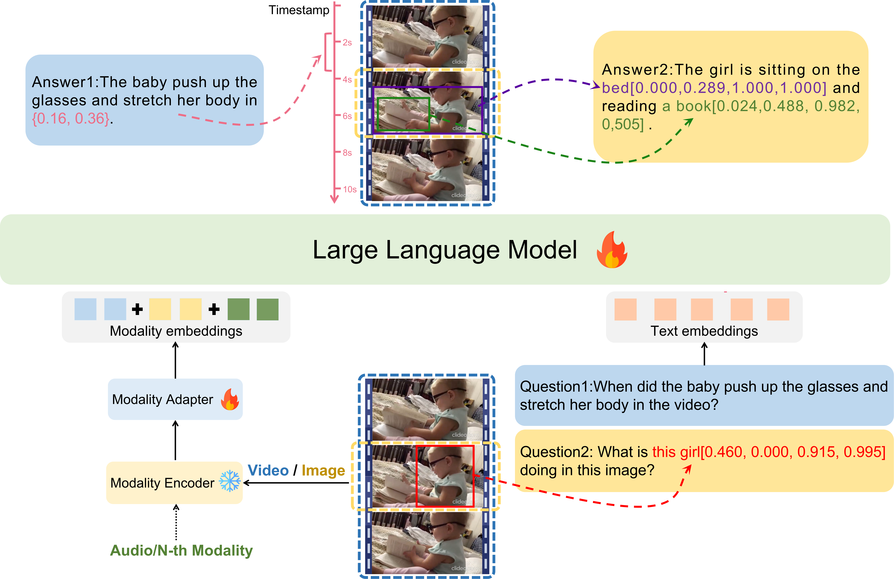

# LEGO:Language-Enhanced Multi-modal Grounding Model

   

## Introduction
LEGO is an end-to-end multimodal grounding model that accuratel comprehends inputs and possesses robust grounding capabilities across multi modalities,including images, audios, and videos. To address the issue of limited data, we construct a diverse and high-quality multimodal training dataset. This dataset encompasses a rich collection of multimodal data enriched with spatial and temporal information, thereby serving as a valuable resource to foster further advancements in this field. Extensive experimental evaluations validate the effectiveness of the LEGO model in understanding and grounding tasks across various modalities. 

More details are available in our [project page](https://github.com/lzw-lzw/LEGO). 

      
    The overall structure of LEGO. Blue boxes represent video as input, while yellow boxes represent image as input.

## Release
We will soon open-source our datasets, codes and models, stay tuned!
- [1/11] 🔥 We released the LEGO [paper](https://github.com/lzw-lzw/LEGO).

## Demo

## Acknowledgement
- [LLaVA](https://github.com/haotian-liu/LLaVA)
- [Video-LLaMA](https://github.com/DAMO-NLP-SG/Video-LLaMA)
- [Shikra](https://github.com/shikras/shikra)
